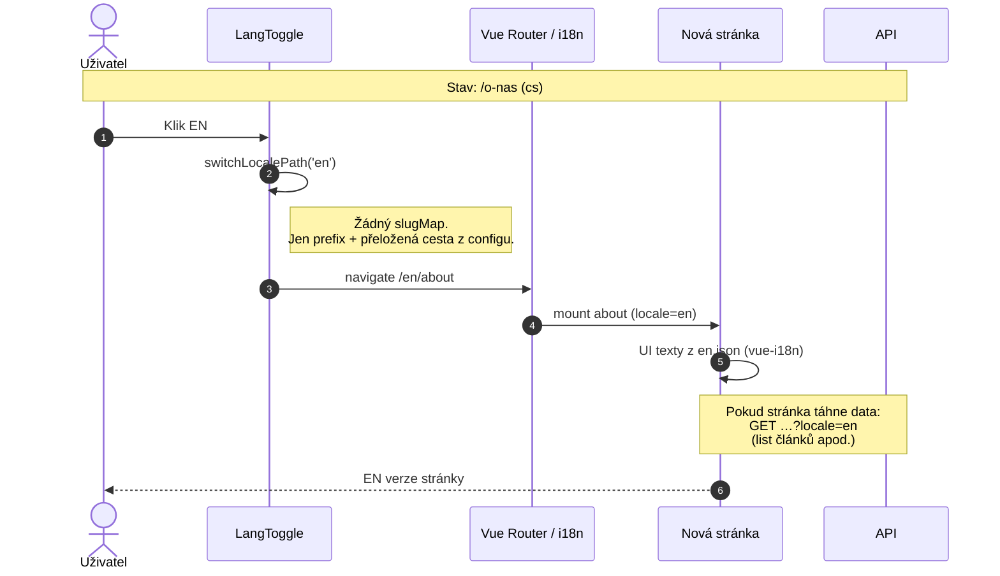
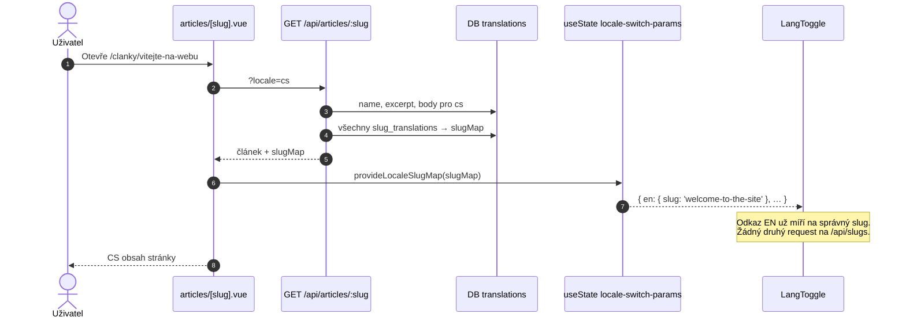
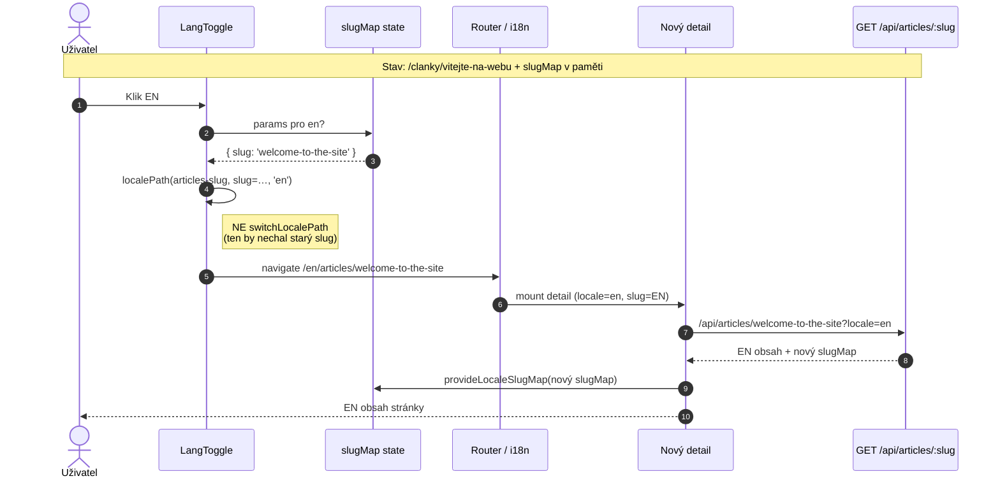

# i18n & lokalizovaná data

Jak v aplikaci fungují jazyky, překlady UI a lokalizované URL (slugy).

## Dvě vrstvy

| Vrstva | Co | Kde |
|--------|----|-----|
| **UI / systém** | Popisky, navigace, API chybové hlášky | `i18n/locales/*.json` + `@nuxtjs/i18n` |
| **Obsah (CMS data)** | Názvy článků, excerpt, body, URL slug | DB: `texts` / `slugs` / `long_texts` + `*_translations` |

UI se překládá přes vue-i18n. Obsah entity (článek) se bere z DB podle `language_id`.

Default locale: `site.defaultLocale` / env `NUXT_PUBLIC_DEFAULT_LOCALE` (nebo `NUXT_LOCALE_DEFAULT`) → `runtimeConfig.public.defaultLocale`.

---

## Diagramy: co se děje po přepnutí jazyka

Klik na vlajku **není API call** — je to navigace na jinou URL. Rozdíl je jen v tom, **jak `LangToggle` tu URL složí**.

### Případ A — statická stránka (bez DB slugů)

Příklady: `/o-nas`, `/kontakt`, `/clanky` (výpis), homepage.

Cesty jsou v `nuxt.config` → `i18n.pages` (nebo default route names). Stačí `switchLocalePath('en')`.



```mermaid
flowchart LR
  subgraph before ["Před klikem"]
    A1["URL: /o-nas"]
    A2["locale = cs"]
    A3["LangToggle: to = switchLocalePath"]
  end

  subgraph click ["Klik EN"]
    B1["switchLocalePath('en')"]
    B2["→ /en/about"]
  end

  subgraph after ["Po navigaci"]
    C1["URL: /en/about"]
    C2["locale = en"]
    C3["JSON UI: en.json"]
    C4["Volitelně API s ?locale=en"]
  end

  A1 --> B1
  A2 --> B1
  A3 --> B1
  B1 --> B2
  B2 --> C1
  C1 --> C2
  C2 --> C3
  C2 --> C4
```

**Shrnutí A:** žádná mapa z DB, žádná extra data v payloadu. Přepínač jen přepíše lokalizovanou cestu z i18n configu.

---

### Případ B — detail se slugem v DB (mapper nutný)

Příklad: článek — v DB jiné URL pro každý jazyk.

```
slugMap = {
  cs: 'vitejte-na-webu',
  sk: 'vitajte-na-webe',
  en: 'welcome-to-the-site'
}
```

Bez mapperu by EN odkaz byl `/en/articles/vitejte-na-webu` → špatně / 404.

#### 1) Načtení detailu (ještě před klikem)



#### 2) Klik na jiný jazyk



```mermaid
flowchart TB
  subgraph load ["① Načtení CS detailu"]
    L1["GET /api/articles/vitejte-na-webu?locale=cs"]
    L2["Response: title, body, …"]
    L3["Response: slugMap<br/>cs / sk / en"]
    L4["provideLocaleSlugMap → LangToggle"]
    L1 --> L2
    L1 --> L3
    L3 --> L4
  end

  subgraph click ["② Klik EN"]
    K1["LangToggle čte slugMap.en"]
    K2["Složí URL<br/>/en/articles/welcome-to-the-site"]
    K3["Navigace — stále žádné API jen kvůli kliku"]
    K1 --> K2 --> K3
  end

  subgraph after ["③ Nová stránka"]
    N1["GET …/welcome-to-the-site?locale=en"]
    N2["EN title + body"]
    N3["znovu slugMap v response"]
    N1 --> N2
    N1 --> N3
  end

  load --> click --> after
```

**Porovnání odkazů**

| | Bez `slugMap` | Se `slugMap` |
|--|---------------|--------------|
| Z CS na EN | `/en/articles/vitejte-na-webu` ❌ | `/en/articles/welcome-to-the-site` ✅ |
| Zdroj slugu | aktuální `route.params.slug` | DB překlad pro cílový locale |
| Extra data | — | ~objekt 2–3 stringů v detail response |

---

## Co se načítá kde

### Každá stránka (Header)

```
GET /api/languages
→ [{ code, name, icon, isDefault }, …]
```

- cacheovaný seznam aktivních jazyků z tabulky `languages`
- ikony vlajek = `languages.icon` (cesty jako `/icons/flags/cz.svg`)
- **1 request na session / key `languages`**, ne při každém přepnutí jazyka

`LangToggle` z toho skládá odkazy. Bez dalších dat jen změní locale prefix (`/clanky/…` → `/en/articles/…`) a **nechá stejný slug v URL**.

### Výpis článků

```
GET /api/articles?locale=cs
→ [{ id, slug, title, description, image, publishedAt, … }, …]
```

- jen **aktuální** jazyk (název, excerpt, slug)
- **bez** `slugMap`, **bez** body

### Detail článku

```
GET /api/articles/:slug?locale=cs
→ {
    id, slug, title, description, body, …,
    slugMap: { cs: 'vitejte-na-webu', sk: 'vitajte-na-webe', en: 'welcome-to-the-site' }
  }
```

To je jediné místo, kde se „navíc“ pro jazykový přepínač něco posílá:

| Pole | Účel |
|------|------|
| běžný obsah | vykreslení stránky v aktuálním jazyce |
| **`slugMap`** | mapa **locale → URL slug** pro všechny aktivní jazyky |

`slugMap` se **nepřekládá jako text stránky** — slouží jen k tomu, aby `LangToggle` složil správnou cílovou URL:

```
/clanky/vitejte-na-webu  + klik EN
→ /en/articles/welcome-to-the-site
```

Bez `slugMap` by vzniklo `/en/articles/vitejte-na-webu` (špatný / 404 slug).

Tok na detailu:

1. Page načte detail (včetně `slugMap`) — **žádný druhý request na slugy**
2. `provideLocaleSlugMap(article.slugMap)` → `useState('locale-switch-params')`
3. `LangToggle` (v layoutu) přečte state a u každé vlajky nastaví `params.slug` z mapy
4. Při odchodu ze stránky se state vyčistí

---

## Co se NEnačítá navíc při přepnutí jazyka

Samotné **kliknutí na vlajku není API call**.

Je to běžná navigace na jinou URL. Nová stránka si pak načte:

- **detail / list** znovu s `?locale=<nový>` (normální data stránky)
- `languages` — typicky z Nuxt payload / cache (stejný key)
- **nový** `slugMap` znovu v detail response (součást stejného requestu jako obsah)

Žádný samostatný `/api/slugs/...` při view detailu (ten endpoint existuje jen jako generický fallback pro entity, které mapu v payloadu ještě nemají).

---

## Přehled „co je navíc“ kvůli jazykům

```
┌─────────────────────────────────────────────────────────────┐
│  Vždy (layout)                                              │
│    /api/languages     … seznam jazyků + ikony               │
├─────────────────────────────────────────────────────────────┤
│  Detail článku — v tom samém response jako obsah            │
│    slugMap            … locale → slug  (malý objekt,        │
│                         typicky 2–3 stringy)                │
├─────────────────────────────────────────────────────────────┤
│  Není extra request na přepnutí                             │
│    klik = navigace; data nového jazyka až na nové stránce   │
└─────────────────────────────────────────────────────────────┘
```

---

## API chyby (server)

Překlady chyb jdou přes stejné JSON soubory (`api.errors.*`), helper `server/utils/apiI18n.ts`:

- locale requestu: `?locale=` → cookie `i18n_redirected` → `defaultLocale`
- `apiError(event, 404, 'api.errors.articleNotFound')` → `createError({ message })`

---

## Související soubory

| Soubor | Role |
|--------|------|
| `i18n/locales/*.json` | UI + API error texty |
| `shared/config/site.ts` | `defaultLocale` fallback |
| `shared/config/flags.ts` | cesty k vlajkám (seed → `languages.icon`) |
| `app/components/general/LangToggle.vue` | přepínač |
| `app/composables/useLocaleSwitch.ts` | shared state layout ↔ page |
| `app/composables/useEntitySlugSwitch.ts` | `provideLocaleSlugMap` |
| `server/services/i18n/slugMap.ts` | DB lookup mapy slugů |
| `server/utils/apiI18n.ts` | server `t()` + `apiError` |
